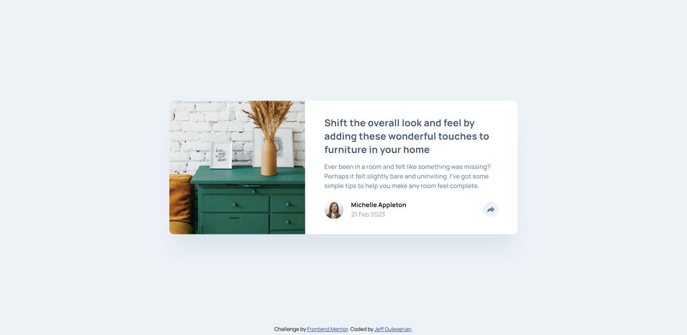
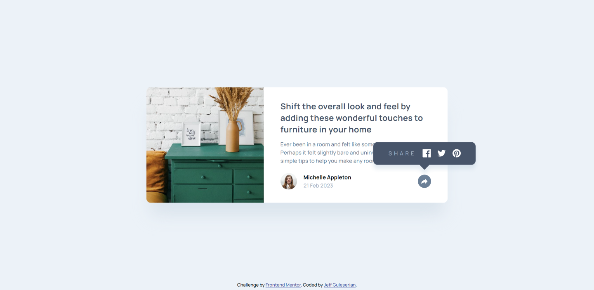
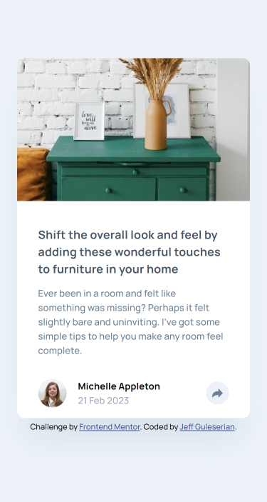
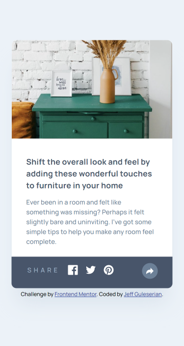

# Frontend Mentor - Article preview component solution

This is a solution to the [Article preview component challenge on Frontend Mentor](https://www.frontendmentor.io/challenges/article-preview-component-dYBN_pYFT). Frontend Mentor challenges help you improve your coding skills by building realistic projects. 

## Table of contents

- [Overview](#overview)
  - [The challenge](#the-challenge)
  - [Screenshot](#screenshot)
  - [Links](#links)
- [My process](#my-process)
  - [Built with](#built-with)
  - [What I learned](#what-i-learned)
  - [Continued development](#continued-development)
- [Author](#author)

## Overview

This Article Preview Component Challenge simulates a component that one might encounter in an online blogging or purchasing scenario (in this case, an article about furniture). The footer of the article displays the author, the date of publication, and a "share" button to post the article on one's social media. 

### The challenge

The challenge, according to FM is that users should be able to:

- View the optimal layout for the component depending on their device's screen size
- See the social media share links when they click the share icon

In addition to these, my personal goals were to be able to:
- Have the date of publication update so it always displayed the current date.
- Create hover effects for the share button and the individual links to the social media channels
- Have the share "bubble" animate/transition in and out
- Have the share "bubble" disappear when the share button is clicked a second time

### Screenshot

### Links

- Solution URL: [GitHub Repository](https://github.com/jguleserian/FMC-ArticlePreviewComponent.git)
- Live Site URL: [Add live site URL here](https://jguleserian.github.io/FMC-ArticlePreviewComponent/)

## My process

My process and workflow is similar to that of previous projects. The following is a synopsis:
- Receive project
- Take a look at overall design and analyze FM goals; then determine additional personal goals
- Create original files and file structure
- Initialize Git for version control
- Set up basic HTML boilerplate and content
- Structure CSS file and perform a reset on the page
- Examine original to plan an overall structure
- Place HTML structure within structure
- Divide the structure into substructure or individual elements, working from top to bottom
- Style sections and elements from top to bottom with CSS for 1440px and then 375px
- Style pseudo elements and pseudo classes
- Determine what functionality is needed and break it down into separate pieces
- Implement jQuery and JavaScript as necessary to program function; test page
- Clean up code structure; double-check formatting and functionality
- Create repository on GitHub and publish to website
- Write README.me and submit to Frontend Mentor

### Built with

- Semantic HTML5 markup
- CSS custom properties
- Flexbox
- CSS Grid
- Mobile-first workflow
- [jQuery](https://jQuery.com/) - JS library

### What I learned

Key learning areas where I increased knowledge/experience or skill:
- JavaScript
- Pseudo classes
- jQuery animations
- styling .svg files

### Continued development

After creating the pop-up, animated "bubble" for the social icons, I became increasingly interested in looking for other JS libraries that could provide simpler implementation of the same. For this reason, I have revisited React and trying to implement it from both a purely front-end (i.e., in the HTML) and from the back-end (i.e., through Node.js and npm).

## Author

- Frontend Mentor - [@jguleserian](https://www.frontendmentor.io/profile/jguleserian)
- LinkedIn - [@jeffguleserian](https://www.linkedin.com/in/jeffguleserian/)
- GitHub - [@jguleserian](https://github.com/jguleserian)

